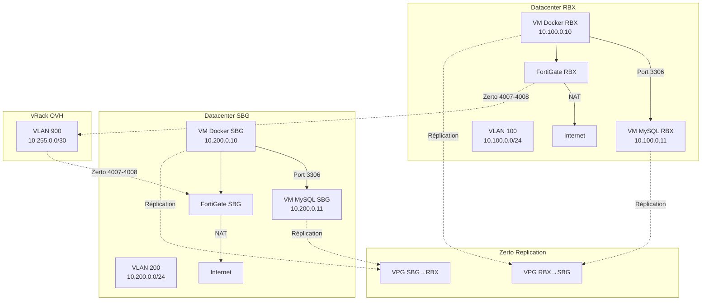

# Documentation Technique - Infrastructure Applicative OVH VMware

## Architecture globale



## Modules Terraform

### Hiérarchie des modules

```
terraform/ovh-infrastructure/
├── main.tf                    # Orchestration principale
├── providers.tf               # Configuration providers (vSphere, FortiOS)
├── variables.tf               # Variables d'entrée
├── outputs.tf                 # Outputs (IPs, UUIDs, inventaire Ansible)
├── zerto.tf                   # Configuration VPG Zerto
└── terraform.tfvars.example   # Template configuration

modules/
├── 06-ovh-vm-docker/          # Module VM Docker
│   ├── main.tf
│   ├── variables.tf
│   ├── outputs.tf
│   └── templates/
│       └── cloud-init.yaml.tpl
│
├── 07-ovh-vm-mysql/           # Module VM MySQL
│   ├── main.tf
│   ├── variables.tf
│   ├── outputs.tf
│   └── templates/
│       └── cloud-init.yaml.tpl
│
├── 08-ovh-network-config/     # Module réseau vRack
│   ├── main.tf
│   ├── variables.tf
│   └── outputs.tf
│
└── 09-ovh-fortigate-rules/    # Module règles FortiGate
    ├── main.tf
    ├── variables.tf
    └── outputs.tf
```

### Module 06-ovh-vm-docker

**Responsabilité** : Provisionner une VM Ubuntu avec Docker Engine et Docker Compose

**Inputs clés :**
- `vm_name` : Nom de la VM (ex: VM-DOCKER-APP-A-RBX)
- `vm_num_cpus`, `vm_memory_mb`, `vm_disk_size_gb` : Dimensionnement
- `vm_ipv4_address`, `vm_ipv4_gateway` : Configuration réseau
- `docker_version`, `docker_compose_version` : Versions à installer

**Outputs clés :**
- `vm_uuid` : UUID vSphere (pour intégration Zerto)
- `ssh_connection_string` : Commande SSH
- `zerto_vm_info` : Structure complète pour VPG Zerto

**Cloud-init** :
- Installation Docker depuis repository officiel Docker
- Configuration daemon Docker (log rotation, overlay2, live-restore)
- Hardening sécurité (UFW, fail2ban)
- Installation monitoring (node_exporter, cAdvisor)
- Montage disque additionnel optionnel pour volumes Docker

### Module 07-ovh-vm-mysql

**Responsabilité** : Provisionner une VM Ubuntu avec MySQL 8.0 optimisée

**Inputs clés :**
- `vm_data_disk_size_gb` : Disque dédié pour `/var/lib/mysql`
- `vm_log_disk_size_gb` : Disque optionnel pour `/var/log/mysql`
- `mysql_innodb_buffer_pool_size` : Tuning InnoDB (recommandé: 70% RAM)
- `mysql_max_connections` : Nombre max connexions
- `mysql_allowed_hosts` : Liste IPs autorisées à se connecter

**Optimisations MySQL** :
```ini
innodb_buffer_pool_size = 12G          # 70% de 16 Go RAM
innodb_log_file_size = 512M
innodb_flush_log_at_trx_commit = 2     # Performance vs durabilité
innodb_flush_method = O_DIRECT         # Bypass cache OS
innodb_file_per_table = 1              # 1 fichier par table
```

**Disk provisioning** :
- Disque OS : Thin provisioning
- Disque données : **Thick provisioning eager zeroed** (meilleures performances I/O)

### Module 08-ovh-network-config

**Responsabilité** : Configuration des port groups vSphere pour vRack OVH

**Port Groups créés :**
1. **VLAN-100-RBX-Private** : Réseau privé RBX (10.100.0.0/24)
2. **VLAN-200-SBG-Private** : Réseau privé SBG (10.200.0.0/24)
3. **VLAN-900-Backbone** : Interconnexion inter-DC (10.255.0.0/30)

**Configuration sécurité :**
- Promiscuous mode : **Désactivé**
- Forged transmits : **Désactivé**
- MAC changes : **Désactivé**
- Teaming : Active-Active (uplink1 + uplink2)

### Module 09-ovh-fortigate-rules

**Responsabilité** : Configuration automatisée des règles firewall FortiGate

**Règles FortiGate RBX :**

| Policy ID | Nom | Source | Destination | Service | Action | NAT |
|-----------|-----|--------|-------------|---------|--------|-----|
| 100 | Allow_Docker_to_MySQL_RBX | 10.100.0.10 | 10.100.0.11 | MySQL/3306 | Accept | Non |
| 101 | NAT_Docker_RBX_to_Internet | 10.100.0.10 | any | ALL | Accept | SNAT |
| 102 | Allow_Zerto_RBX_to_SBG | all | 10.200.0.0/24 | TCP/4007-4008 | Accept | Non |

**Règles FortiGate SBG :** (Identiques avec IPs SBG)

## Playbooks Ansible

### ansible/playbooks/ovh-infrastructure/configure-all.yml

**Responsabilité** : Post-configuration et tests de l'infrastructure déployée

**Étapes** :
1. **Pre-tasks** : Attente fin cloud-init, vérification connectivité Internet
2. **Configuration Docker** : Vérification versions, test conteneur hello-world
3. **Configuration MySQL** : Vérification service, test connexion locale
4. **Tests connectivité** : Ping inter-VMs, test port 3306
5. **Résumé** : Affichage rapport consolidé

## Scripts de déploiement

### scripts/deploy-ovh-infrastructure.sh

**Workflow** :
```bash
1. check_prerequisites()        # Vérifier Terraform, Ansible, SSH, terraform.tfvars
2. terraform_init()             # terraform init -upgrade
3. terraform_plan()             # terraform plan -out=tfplan
4. terraform_apply()            # terraform apply tfplan
5. terraform_output()           # Sauvegarder outputs JSON
6. generate_ansible_inventory() # Générer inventory.yml depuis output Terraform
7. run_ansible_playbooks()      # ansible-playbook configure-all.yml
8. print_summary()              # Afficher résumé + next steps
```

**Options** :
- `--auto-approve` : Skip confirmation (pour CI/CD)

### scripts/destroy-ovh-infrastructure.sh

**Sécurités** :
- Confirmation explicite (taper "DESTROY" en majuscules)
- Désactivation VPG Zerto avant destruction VMs
- Nettoyage fichiers temporaires (tfplan, outputs, inventory)

## Configuration réseau détaillée

### Plan d'adressage IP

| Site | VLAN | Réseau | Gateway | Docker VM | MySQL VM |
|------|------|--------|---------|-----------|----------|
| RBX | 100 | 10.100.0.0/24 | 10.100.0.1 | 10.100.0.10 | 10.100.0.11 |
| SBG | 200 | 10.200.0.0/24 | 10.200.0.1 | 10.200.0.10 | 10.200.0.11 |
| Backbone | 900 | 10.255.0.0/30 | - | 10.255.0.1 (RBX FG) | 10.255.0.2 (SBG FG) |

### Flux réseau autorisés

```
┌──────────────┐                    ┌──────────────┐
│  VM Docker   │ ──── MySQL ───────→│  VM MySQL    │
│  10.100.0.10 │      3306          │  10.100.0.11 │
└──────────────┘                    └──────────────┘
       │
       │ HTTP/HTTPS
       ↓
┌──────────────┐
│ FortiGate RBX│ ──── SNAT ────────→ Internet
└──────────────┘
       │
       │ Zerto 4007-4008
       ↓
┌──────────────┐
│   vRack      │ ←────────────────→ FortiGate SBG
│  VLAN 900    │
└──────────────┘
```

## Intégration Zerto

### Virtual Protection Groups (VPG)

#### VPG-RBX-to-SBG

```json
{
  "vpg_name": "VPG-RBX-to-SBG-prod",
  "source_site": "rbx-site-12345",
  "target_site": "sbg-site-67890",
  "protected_vms": [
    {
      "name": "VM-MYSQL-APP-A-RBX",
      "boot_priority": 1,
      "boot_delay_seconds": 0
    },
    {
      "name": "VM-DOCKER-APP-A-RBX",
      "boot_priority": 2,
      "boot_delay_seconds": 60
    }
  ],
  "rpo_seconds": 300,
  "journal_hours": 24,
  "compression": true,
  "encryption": "AES-256"
}
```

### Scénario de failover détaillé

1. **Détection panne** : RBX datacenter indisponible
2. **Zerto initie failover** :
   - Récupération dernier checkpoint journal (max RPO 300s)
   - Provisioning VMs sur cluster SBG
3. **Démarrage séquentiel** :
   - `t=0s` : VM-MYSQL-APP-A-RBX démarre sur SBG avec IP 10.200.0.11
   - `t=60s` : VM-DOCKER-APP-A-RBX démarre sur SBG avec IP 10.200.0.10
4. **Remapping réseau** : FortiGate SBG active règles pour nouvelles IPs
5. **Application opérationnelle** : `t=15min` maximum (RTO)

## Monitoring

### Métriques exposées

| Service | Port | Métriques |
|---------|------|-----------|
| node_exporter | 9100 | CPU, RAM, Disk, Network |
| cAdvisor | 8080 | Conteneurs Docker (CPU, RAM, I/O) |
| mysqld_exporter | 9104 | Connexions, queries, InnoDB buffer pool |

### Healthchecks recommandés

```bash
# Vérifier Docker
docker ps
docker stats --no-stream

# Vérifier MySQL
systemctl status mysql
mysql -u root -e "SHOW GLOBAL STATUS LIKE 'Threads_connected';"

# Vérifier réplication Zerto
# Via Zerto UI ou API REST
```

## Troubleshooting

### Problème : VMs ne démarrent pas après déploiement Terraform

**Symptômes** : `terraform apply` réussit mais VMs inaccessibles SSH

**Solutions** :
1. Vérifier cloud-init : `ssh vmadmin@<IP> cloud-init status`
2. Consulter logs : `/var/log/cloud-init.log`, `/var/log/cloud-init-output.log`
3. Vérifier VMware Tools : `vmware-toolbox-cmd -v`

### Problème : MySQL refuse connexions depuis Docker

**Symptômes** : `ERROR 1130 (HY000): Host '10.100.0.10' is not allowed to connect`

**Solutions** :
```sql
-- Se connecter en local sur VM MySQL
mysql -u root

-- Vérifier utilisateurs
SELECT user, host FROM mysql.user WHERE user='appuser';

-- Ajouter host manquant
CREATE USER 'appuser'@'10.100.0.10' IDENTIFIED BY 'password';
GRANT ALL PRIVILEGES ON app_rbx_db.* TO 'appuser'@'10.100.0.10';
FLUSH PRIVILEGES;
```

### Problème : Règles FortiGate non appliquées

**Symptômes** : Terraform indique succès mais règles absentes dans FortiGate UI

**Solutions** :
1. Vérifier token API FortiGate : `curl -k https://<fortigate-ip>/api/v2/cmdb/system/admin -H "Authorization: Bearer <token>"`
2. Vérifier logs Terraform : `terraform apply 2>&1 | grep fortios`
3. Créer règles manuellement via UI comme fallback

## Références

- [Terraform Provider vSphere](https://registry.terraform.io/providers/hashicorp/vsphere/latest/docs)
- [Terraform Provider FortiOS](https://registry.terraform.io/providers/fortinetdev/fortios/latest/docs)
- [Zerto Virtual Replication API](https://www.zerto.com/myzerto/knowledge-base/)
- [OVH Private Cloud VMware](https://docs.ovh.com/fr/private-cloud/)
- [MySQL 8.0 Performance Tuning](https://dev.mysql.com/doc/refman/8.0/en/optimization.html)
